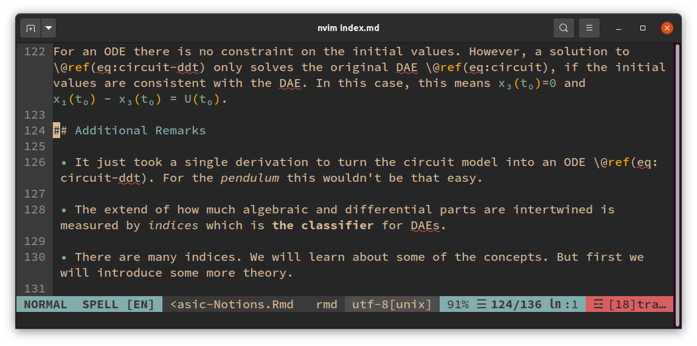

While things were shifting away from *away from keyboard*, I found little pleasures in seeing software tools in production. Most of all I enjoy small scripts[^1] that take a few lines of readable text and turn it into a [website for an online course](https://www.janheiland.de/courses/mathe2info-21/), into [lecture notes](https://www.janheiland.de/script-daes/basic-definitions-and-notions.html), or a [slide deck for presentation](http://www.janheiland.de/talk-gpuq/#/title-slide).

This all bases on `Markdown` text files and some interpreter and compiler. For the websites the interpreter is `hugo`, for the lecture nodes it is `bookdown`, and for the presentation it is `pandoc` and `reveal.js`.

The sources are conveniently edited in my favorite editor. With *syntax highlighting* and *code concealing*, the basic parts of the markup is partially hidden and already preinterpreted. 

The final compilation and interpretation is well kept out of sight and can be automated or not on many stages.

Together with other little *unix* tools[^2], it took me just one hour to [turn my notes](https://github.com/highlando/pandoc-markdown-book-template/blob/master/RUNME.md) on my *natural yeast recipes* into an *e-book* and arrange the pdf export such that it could be printed as an [8-page booklet on a single A4 page](https://www.instructables.com/A-one-sheet-of-paper-booklet/).

Please checkout the outcomes:

 * :orange_book: [Booklet of my recipes for baking](lm.pdf) 
 * :blue_book: [Ready to be printed and folded into a real booklet](ready-for-print.pdf) 

[^1]: Similarly exciting and helpful but on a different level are high-end open source tools like `OBS` for screencasting and streaming or `audacity` for podcasting.
[^2]: Namely `Okular` for exporting epub to pdf, `pdftk` for rotating, cutting, and arranging, and `boomaga` 
